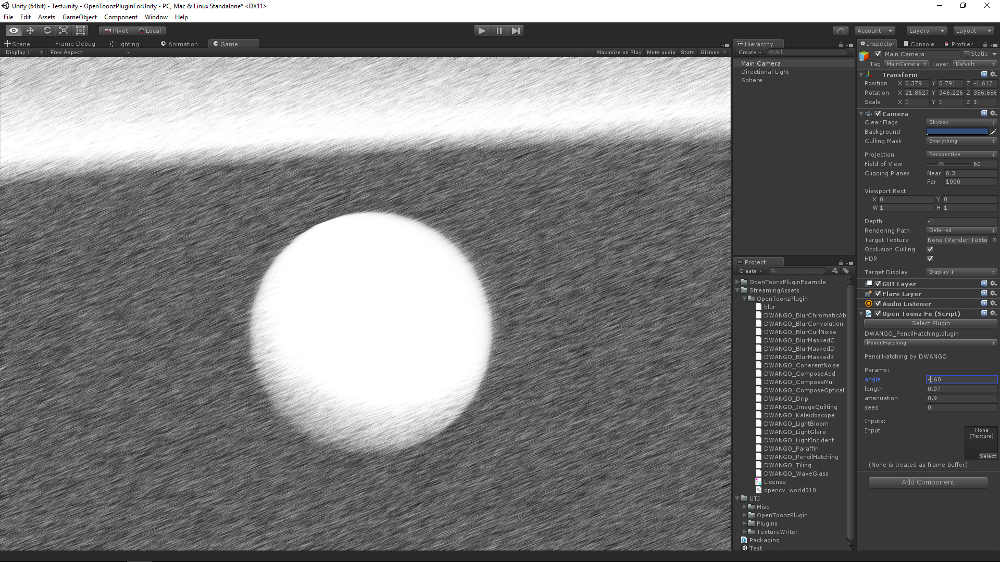

# OpenToonzPluginForUnity
[English](https://translate.google.com/translate?sl=ja&tl=en&u=https://github.com/unity3d-jp/OpenToonzPluginForUnity) (by Google Translate)

OpenToonz 用のプラグインを Unity の PostEffect として使えるようにするプラグインです。  
映像制作用途を想定したもので、デルタタイムを固定して事前に指定しておいた範囲のフレームを書き出す、といった使い方を想定しています。
フレームの書き出しには [FrameCapturer](https://github.com/unity3d-jp/FrameCapturer) などが使えるでしょう。  
OpenToonz のプラグインがリアルタイム向けではないため、残念ながらゲームへの使用は厳しいかと思われます。  

## How To Use

1. こちらのパッケージをインポート [OpenToonzPluginForUnity.unitypackage](https://github.com/unity3d-jp/OpenToonzPluginForUnity/blob/master/Packages/OpenToonzPluginForUnity.unitypackage?raw=true)  
2. OpenToonz 用のプラグインを Assets/StreamingAssets/OpenToonzPlugin に配置  
3. エフェクトを適用したいカメラに OpenToonzFx コンポーネントを追加 (AddComponent -> UTJ/OpenToonzFx)  
4. "Select Plugin" でプラグインを選択。プラグイン用のパラメータが表示されるので適宜設定  

サンプルとしてドワンゴが提供しているプラグインのパッケージも置いています：[DWANGO_Plugins.7z](https://github.com/unity3d-jp/OpenToonzPluginForUnity/blob/master/Packages/DWANGO_Plugins.7z?raw=true)  
右のスクリーンショットは DWANGO_PencilHatching.plugin を選択した例です。
OpenToonz のプラグインは一つの .plugin ファイルに複数のコンポーネントを持てるようになっており、複数ある場合はドロップダウンリストから目的のものを選びます。  
Param は文字通りプラグインが受け取るパラメータで、int, Range, Color, Point などいくつかのタイプがあります。  
Inputs は画像の入力で、Texture2D や RenderTexture を設定可能です。未設定の場合フレームバッファが入力になります。

プラグインの配置場所は、エディタの場合はどこでも問題ありませんが、ビルドして配布する場合は Assets/StreamingAssets 以下でないとパッケージに含まれなくなります。  
また、プラグインが外部 dll への依存関係を持つ場合、その dll も参照可能な場所にある必要があります。プラグインと同じディレクトリも参照可能にしているため、プラグインと依存 dll を一緒に置いておけばいいでしょう。例えばドワンゴ製のプラグイン群はそのほとんどが opencv_world310.dll に依存しているため、これもプラグインの配置場所に置いておく必要があります。

カメラが HDR モードの場合、フレームバッファの内容を LDR に変換してからエフェクトを適用します。
このため、**エフェクト適用後の情報量は LDR 相当に劣化しています**。ご注意ください。  
エフェクト適用は RenderTexture の内容を CPU 側にコピー -> エフェクト適用 -> GPU 側に書き戻す という手順で行われています。
つまり、すごく遅いです。

## How To Build
ソースからビルドする場合、このリポジトリを **pull した後、setup.bat を実行** してから
 Plugins/OpenToonzPlugin.sln を開いてビルドします。  
OpenToonzPlugin.dll には Unity への依存はないため、他のアプリケーションへの組み込みも容易かと思われます。
使い方は [Test.cpp](Plugin/Test/Test.cpp) を見ればだいたい分かるかと思われます。
otpParam が double、int、Range といったパラメータを渡す役割を担い、otpPort が画像の入力の役割を担います。

## Issues
現在 Spectrum や ToneCurve などの一部のパラメータは未対応です。  
プラグインホストのインターフェースも一部未実装なため、正常に動作しないプラグインもあるかもしれません。

## Thanks
- OpenToonz のソースを大いに参考にしています。  
  https://github.com/opentoonz
- Intel ISPC を用いて一部の処理を高速化しています。  
  http://ispc.github.io/

## License
MIT-License:

Copyright (C) 2016 Unity Technologies Japan, G.K.

Permission is hereby granted, free of charge, to any person obtaining a copy of this software and associated documentation files (the "Software"), to deal in the Software without restriction, including without limitation the rights to use, copy, modify, merge, publish, distribute, sublicense, and/or sell copies of the Software, and to permit persons to whom the Software is furnished to do so, subject to the following conditions: The above copyright notice and this permission notice shall be included in all copies or substantial portions of the Software.

THE SOFTWARE IS PROVIDED "AS IS", WITHOUT WARRANTY OF ANY KIND, EXPRESS OR IMPLIED, INCLUDING BUT NOT LIMITED TO THE WARRANTIES OF MERCHANTABILITY, FITNESS FOR A PARTICULAR PURPOSE AND NONINFRINGEMENT. IN NO EVENT SHALL THE AUTHORS OR COPYRIGHT HOLDERS BE LIABLE FOR ANY CLAIM, DAMAGES OR OTHER LIABILITY, WHETHER IN AN ACTION OF CONTRACT, TORT OR OTHERWISE, ARISING FROM, OUT OF OR IN CONNECTION WITH THE SOFTWARE OR THE USE OR OTHER DEALINGS IN THE SOFTWARE.
